## Hi there 👋 I'm Xinpeng Zhang (University of Nebraska–Lincoln)

🔭 I'm currently working on **CAZymes** and **dbCAN** tools (bcb-unl).  
🌱 I'm currently learning **LLMs** and related technologies.  
👯 I'm looking to collaborate on **bioinformatics** projects.

---

### Personal Activity (GitHub)

  
  

---

### Project / Organization Impact (bcb-unl)

  
  

#### Key Repositories (Stars)

> These badges reflect **repo-level stars** directly under the bcb-unl organization.

- **CAZymes / Related Tooling**:
  -  [`bcb-unl/run_dbcan`](https://github.com/bcb-unl/run_dbcan)
  -  [`bcb-unl/nf-core-dbcanmicrobiome`](https://github.com/bcb-unl/nf-core-dbcanmicrobiome)

---

### Links

- **bcb-unl GitHub**: https://github.com/bcb-unl
- **My GitHub**: https://github.com/Xinpeng021001

---

### Collaboration

If you're interested in **CAZyme annotation**, **metagenomics**, or **LLM-assisted bioinformatics tooling**, feel free to reach out via GitHub.
