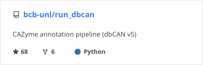
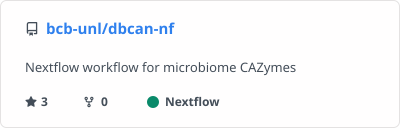

# Xinpeng Zhang

**University of Nebraska–Lincoln** · [bcb-unl](https://github.com/bcb-unl)

---

### About

I am a Ph.D. student in bioinformatics at the University of Nebraska–Lincoln, working on **CAZyme annotation** and the **dbCAN** tool ecosystem. My current interests also include **protein language models** and **LLM-assisted** bioinformatics workflows.

- Building and maintaining **run_dbcan** and related microbiome pipelines under [bcb-unl](https://github.com/bcb-unl)
- Exploring structure- and language-model methods beyond classical HMMER / DIAMOND search
- Looking to collaborate on **CAZyme annotation**, **metagenomics**, and **research software**

---

### Featured tools

Public repositories I contribute to under the **bcb-unl** organization.

  
  &nbsp;
  

---

### GitHub activity

  
  

---

### Stack

  
   
  
  

---

### Links

- **Lab organization**: [bcb-unl](https://github.com/bcb-unl)
- **Personal GitHub**: [Xinpeng021001](https://github.com/Xinpeng021001)

If you are working on CAZyme annotation, metagenomics, or LLM-assisted bioinformatics tooling, feel free to open an issue or reach out via GitHub.
